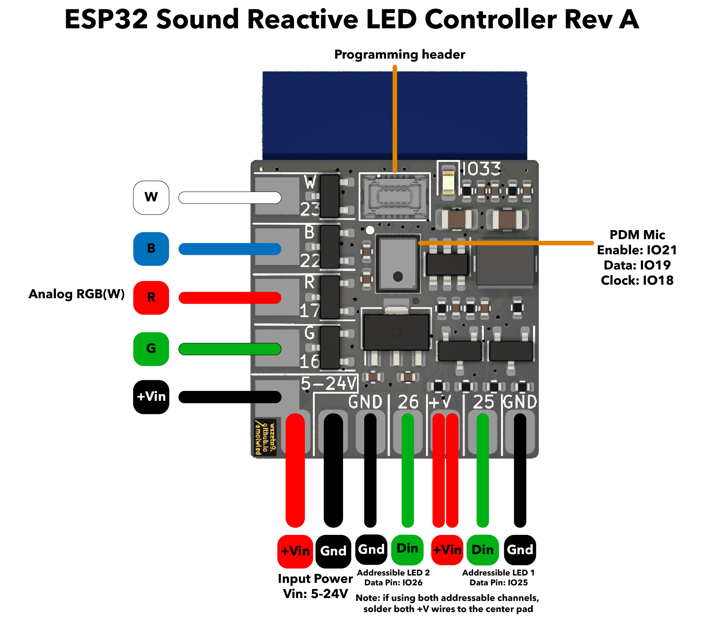

# Small ESP32 SR-WLED Controller

A small LED controller that runs WLED-Sound Reactive. Supports 5-24V analog and addressible lights.

[Interactive BOM](https://htmlpreview.github.io/?https://raw.githubusercontent.com/wszeto9/Small-ESP32-SR-WLED-Controller/main/Documentation/ibom.html)

<h2> Features:</h2>
<ul>
<li>4 Analog Channels (Up to 3A each) for analog RGB and RGBW LED strips</li>
<li>2 Addressible Channels, level shifted to 5V to support single data line and dual data line addressible LED strips.
<li>Variable Input voltage from 5-24V (Input voltage must match the LED strip voltage)
<li>Controlled with an ESP8266 running WLED and connected over Wi-Fi</li>
<li>Panelized in a 2x2 panel of 50x50mm for minimal fabrication costs at JLCPCB</li>
<li>BOM cost is kept low at around $6 per board
</ul>
<h2>Pinout</h2>

<h2> Bring-up and Usage </h2>

- All front components should be soldered by JLCPCB.
- Flip the board and solder the ESP32 WROOM chip.
- Attach the programming device onto the mezzamine connector on the top front of the board
- Program the ESP32 with WLED
- Unplug the programming header
- Solder on lights and a power lead
- Connect to the ESP's Wi-Fi network and turn on the lights!